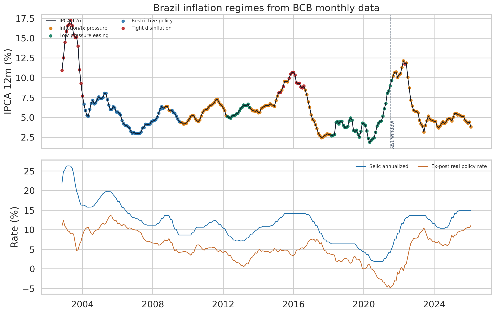
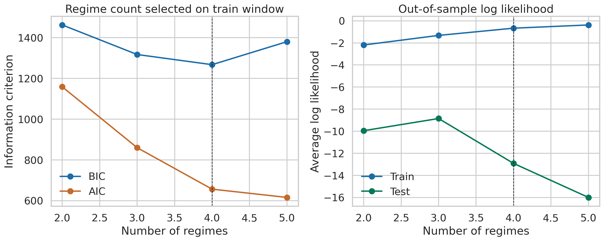
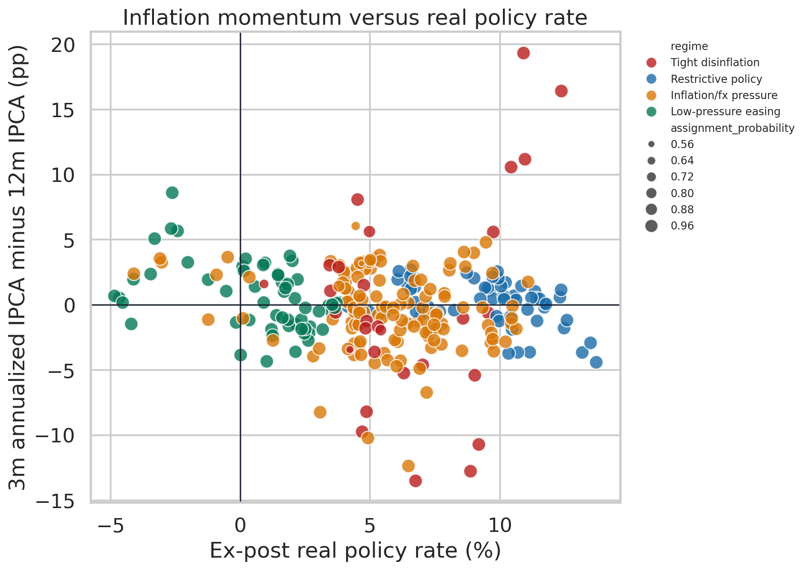
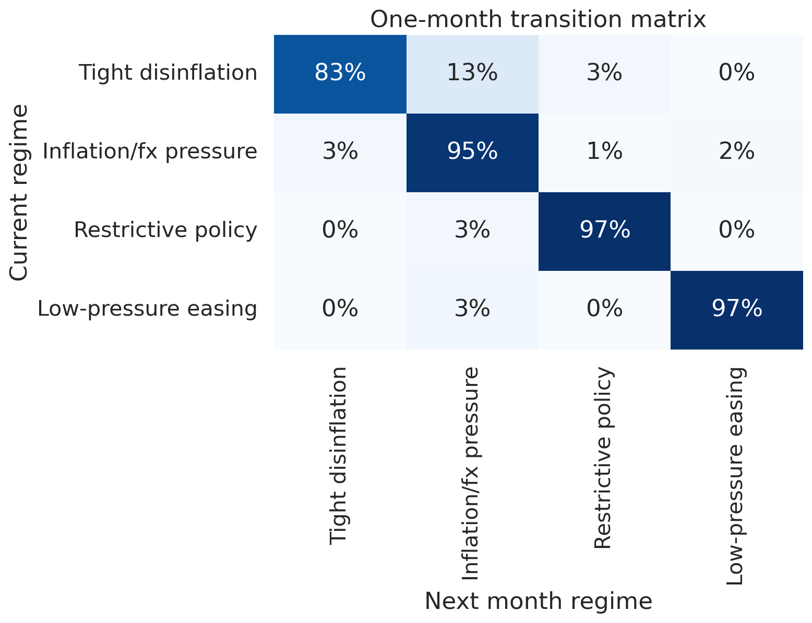
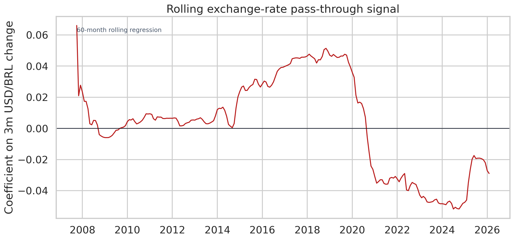
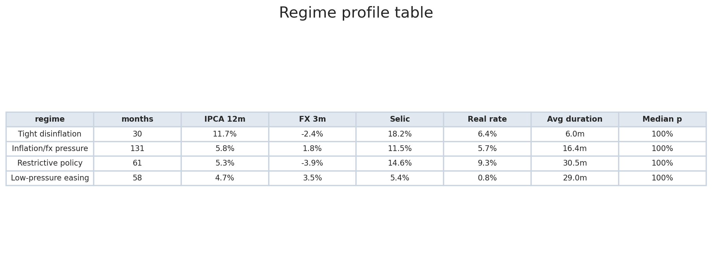
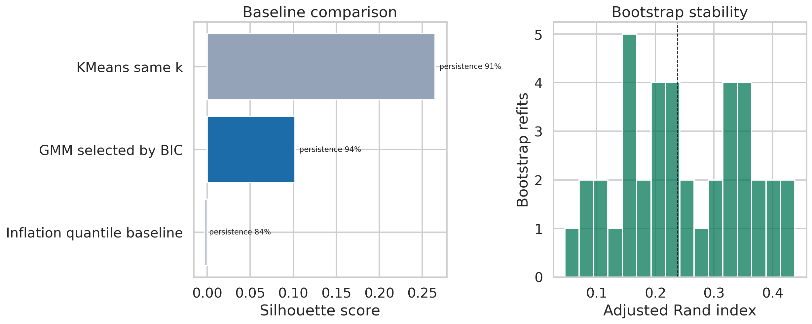

# Brazil inflation pressure and monetary policy regimes

Brazil is a good stress test for macro analysis. Inflation does not move alone here. The exchange rate, Selic cycle, real interest rate, and credibility of the inflation-targeting regime all show up in the data.

This notebook pulls public series from Banco Central do Brasil and builds a monthly panel from IPCA, USD/BRL, and Selic. Then it estimates inflation-pressure regimes and checks a rolling exchange-rate pass-through signal.

## Result

- Data window: **2002-11 to 2026-02**
- Analysis sample: **280 monthly observations**
- Train/test split: **224 train** and **56 test** months
- Regimes selected by train BIC: **4**
- Latest regime: **Inflation/fx pressure**
- Latest IPCA 12m: **3.81%**
- Latest Selic, annualized from daily rate: **14.90%**
- Latest ex-post real policy rate: **11.09%**
- One-month regime persistence: **94.3%**

The latest label should not be read as a crisis call. The regime is named from the component's average behavior, not from one month alone. February 2026 sits in a cluster that has historically mixed inflation pressure, exchange-rate movement, and restrictive policy.

## Model Selection

I fit Gaussian Mixture Models with 2 to 5 regimes on the training window. BIC picks the number of components from train. The last 20% of months are kept for a basic out-of-sample check.

This is still an unsupervised model. It does not know Brazilian history. It only sees features built from inflation, exchange rate, Selic, and real rates.

## Data

All data comes from the public SGS/BCB JSON API.

- IPCA monthly variation: SGS `433`
- USD/BRL exchange rate: SGS `1`
- Selic daily rate: SGS `11`

Engineered features:

- 12-month IPCA
- 3-month annualized IPCA momentum
- 3-month and 12-month exchange-rate movement
- 63-business-day FX volatility
- annualized Selic from daily rate
- ex-post real policy rate
- real-rate gap versus a rolling 60-month average

## Method

The regime model uses standardized monthly features. I also compare the selected GMM with KMeans and a simple inflation-quantile baseline.

For pass-through, I use a 60-month rolling regression. The dependent variable is inflation over the next three months. The explanatory variables are recent USD/BRL movement, current 12-month inflation, and Selic. This is a signal, not a structural causal estimate.

## Diagnostics

The pressure map shows where months sit in inflation-momentum and real-rate space. Restrictive-policy months are visibly different from low-pressure easing periods, but the clusters are not clean boxes.

Regimes are persistent. One-month persistence is about **94.3%**, which is high enough to make the labels useful for macro storytelling. It also means the model is mostly identifying long macro phases, not month-to-month noise.

The rolling pass-through coefficient is unstable and turns negative in the latest window. I do not read that as a deep law. It is a warning that the simple pass-through regression is picking up policy reaction, timing, and omitted macro variables.

The regime table turns the model into something readable: average IPCA, FX move, Selic, real rate, duration, and assignment confidence by regime.

The GMM has low silhouette, and bootstrap stability is modest. Median adjusted Rand index is **0.24**. That is a useful caveat: the broad phases are informative, but exact regime boundaries should not be treated as facts.

## Bibliographic Base

The project is built around three literatures:

- inflation targeting in Brazil
- exchange-rate pass-through in emerging markets
- regime-switching and policy-rule thinking in macroeconomics

The full notes are in [LITERATURE_REVIEW.md](LITERATURE_REVIEW.md). I used the literature to choose the variables and to keep the interpretation careful. The papers do not prove this specific GMM model. They justify why inflation, exchange rate, Selic, real rates, credibility, and regime changes belong in the same analysis.

## Caveats

This is a statistical regime report, not a central-bank model. It does not include expectations, output gap, fiscal variables, administered prices, commodity shocks, credit, or survey data.

I would use this as a portfolio project about macro data science: good public data, clear bibliography, transparent features, regime diagnostics, and honest limitations.

## Files

- `brazil_inflation_monetary_regimes.ipynb`: clean notebook
- `test_bcb_api.py`: smoke test for the BCB/SGS API
- `LITERATURE_REVIEW.md`: scoping-review notes and references
- `assets/`: charts used in this report
- `results_summary.json`: machine-readable output from the latest notebook run
