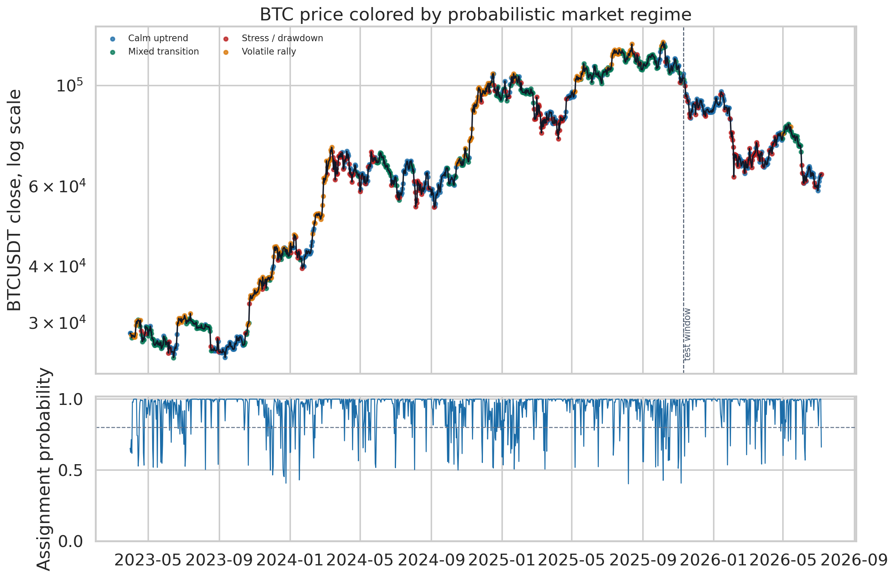
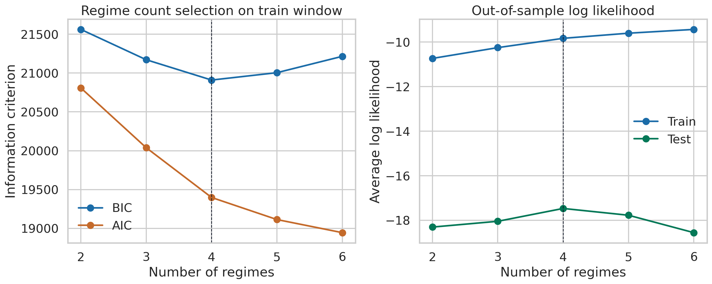
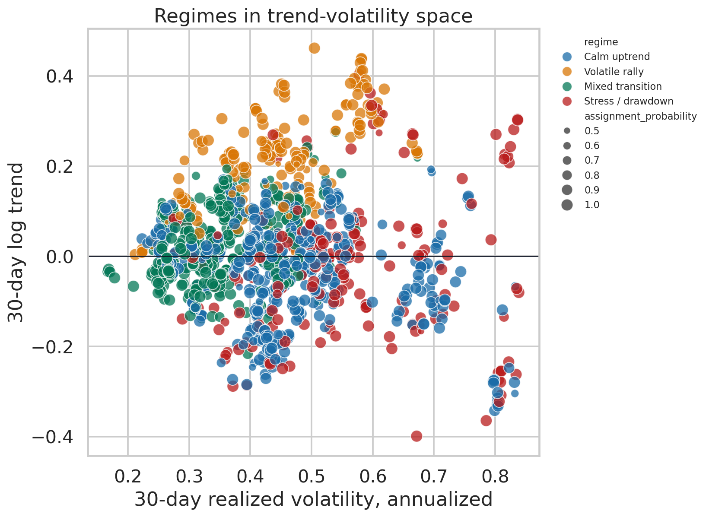
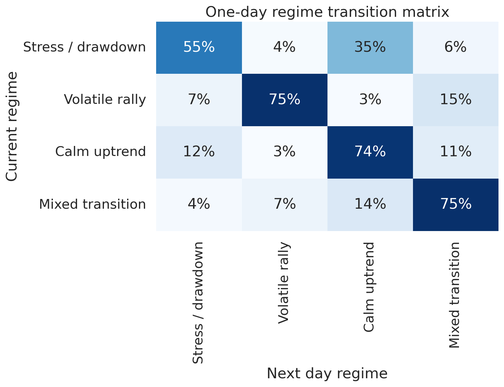
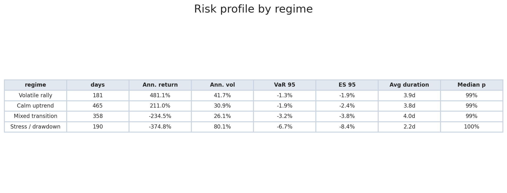
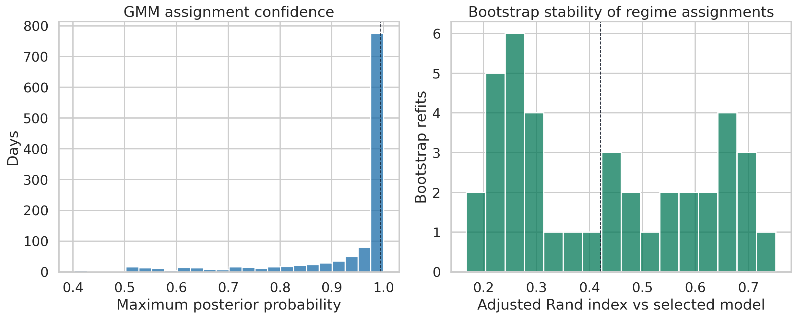
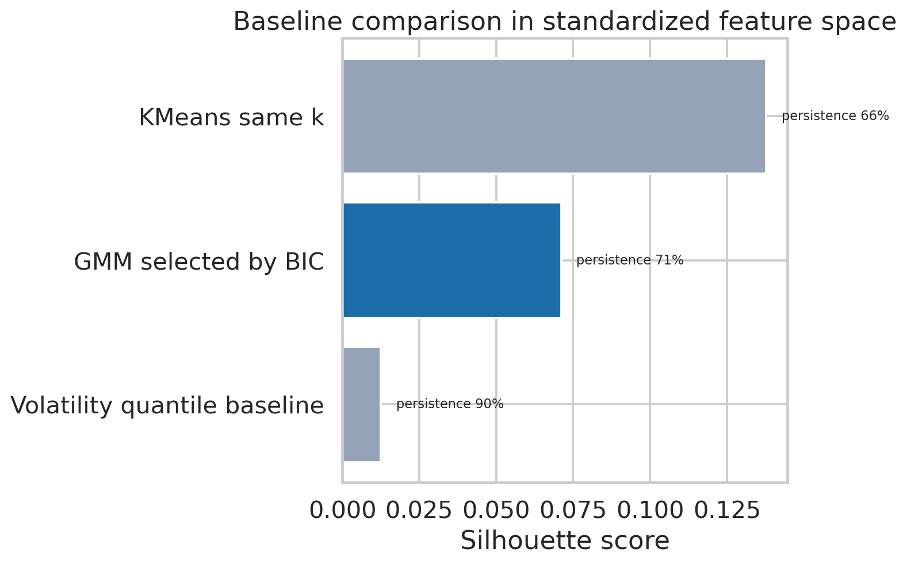

# Crypto market regime detection

BTC does not trade in one constant market mode. Some periods are calm and directional, some are volatile rallies, and others behave like stress or drawdown regimes.

This project treats market-regime detection as an unsupervised time-series problem. It pulls recent BTC/USDT and ETH/USDT daily candles from Binance, engineers market-structure features, selects a Gaussian Mixture Model on a training window, validates it on a held-out test window, and compares the result with simpler baselines.

## Result

- Data window: **2023-03-31 to 2026-07-06**
- Model rows after feature engineering: **1,194**
- Train/test split: **955 train** and **239 test** daily observations
- Selected regimes by train BIC: **4**
- Latest BTC regime: **Stress / drawdown**
- Latest regime probability: **66.1%**
- Median assignment probability: **99.3%**
- Test-window median assignment probability: **99.9%**
- One-day regime persistence: **71.2%**

The key read is not that the latest label is certain. It is not. The latest posterior probability is moderate, which means the model sees BTC near a boundary between regimes. That is useful information: the market is not cleanly sitting in a high-confidence calm state.

## Model Selection

The notebook fits Gaussian Mixture Models with 2 to 6 components on the training window only. The selected model is the one with the lowest BIC on train. The held-out tail is then used as a sanity check for out-of-sample likelihood and assignment confidence.

This is more defensible than choosing the number of regimes from the full sample. The model still remains unsupervised, but the workflow separates model selection from later-period evaluation.

## Data

- Source: Binance public market data endpoint
- Symbols: `BTCUSDT`, `ETHUSDT`
- Interval: daily candles
- Authentication: none
- BTC rows pulled: `1,283`
- Feature-complete BTC rows: `1,194`

Features used:

- BTC log return
- 14-day and 30-day trend
- 7-day and 30-day realized volatility
- 30-day downside volatility
- 90-day drawdown
- intraday range
- volume shock
- trade-intensity shock
- ETH/BTC 7-day relative strength

## Method

The main model is a Gaussian Mixture Model. It clusters days in standardized feature space and returns posterior probabilities for each regime assignment.

The notebook adds three checks that make the analysis less fragile:

- temporal validation: train on the first 80% of observations, evaluate the final 20%
- baseline comparison: compare GMM with KMeans and volatility-quantile regimes
- bootstrap stability: refit the selected number of regimes on bootstrapped training samples and compare assignments with adjusted Rand index

## Diagnostics

The regimes separate broad trend and volatility behavior, but not perfectly. That is expected in crypto: regimes overlap, and sharp transitions are part of the data-generating process.

The transition matrix shows that regimes are persistent enough to be meaningful, with one-day persistence around **71.2%**. This is not a full hidden Markov model, but it gives a practical Markov-style diagnostic.

The risk table translates each regime into portfolio-relevant language: annualized return, annualized volatility, daily VaR 95%, expected shortfall, average duration, and median assignment probability.

The assignment probabilities are high overall, but the bootstrap stability is only moderate. The median adjusted Rand index across bootstrap refits is **0.42**, with a 10th to 90th percentile range from **0.22** to **0.67**. That means the broad structure is useful, but the exact regime partition should not be overinterpreted.

The baseline comparison keeps the model honest. GMM is more expressive than volatility buckets, but the silhouette score is low because financial regimes overlap. That is a limitation, not a failure.

## Interpretation

The model is best read as a market-structure lens:

> BTC currently sits in a stress/drawdown-like region of the feature space, but the latest assignment is not high-confidence. The regime map is useful for describing market state, not for making standalone trading decisions.

The strongest part of the project is the workflow: recent data, feature engineering, train/test separation, BIC selection, out-of-sample validation, transition diagnostics, risk metrics, baseline comparison, and stability checks.

## Caveats

This is unsupervised learning on market features. Regime names are analyst labels, not ground truth. Binance spot candles capture price/volume behavior, not macro causes, leverage, funding, order-book structure, or exchange-wide liquidity.

The project should be read as a statistical regime-detection report, not as financial advice or a trading strategy.

## Files

- `crypto_market_regime_detection.ipynb`: clean notebook
- `test_binance_market_data.py`: smoke test for the Binance kline endpoint
- `assets/`: report charts
- `results_summary.json`: machine-readable output from the latest notebook run
