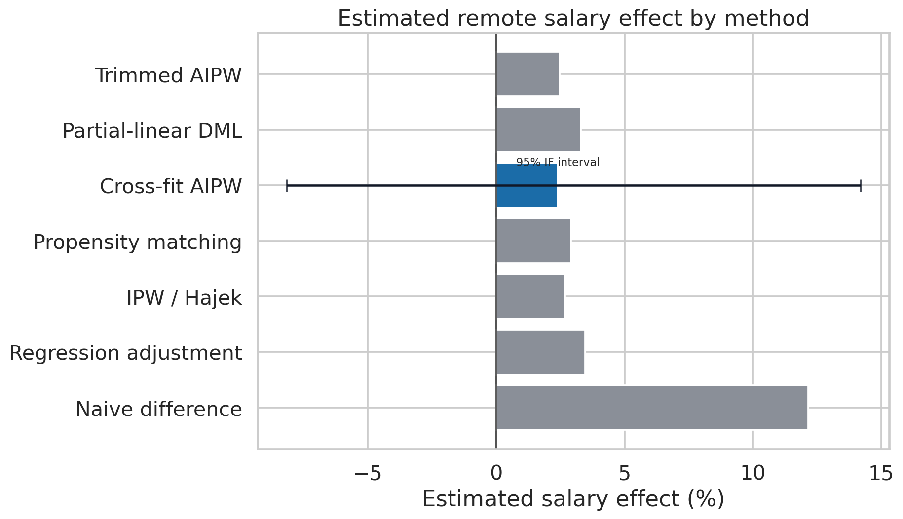
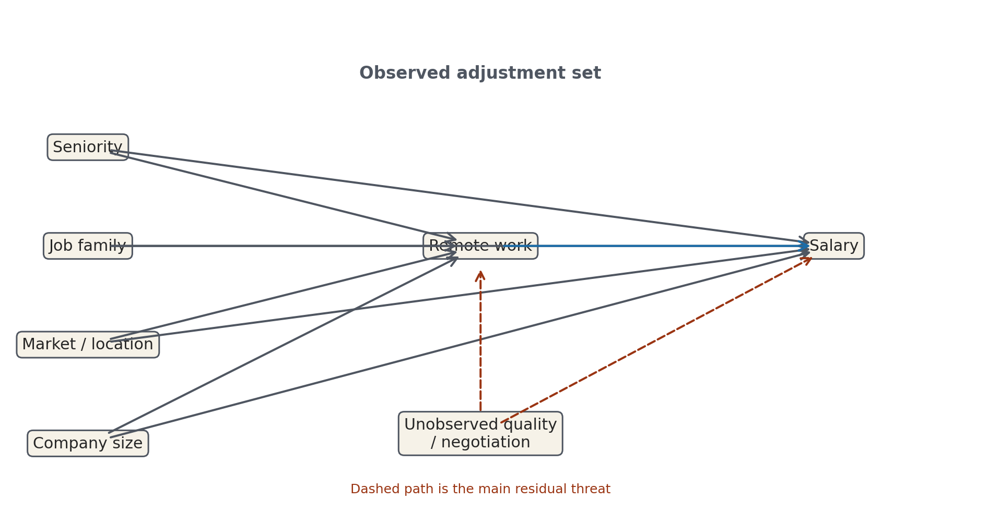
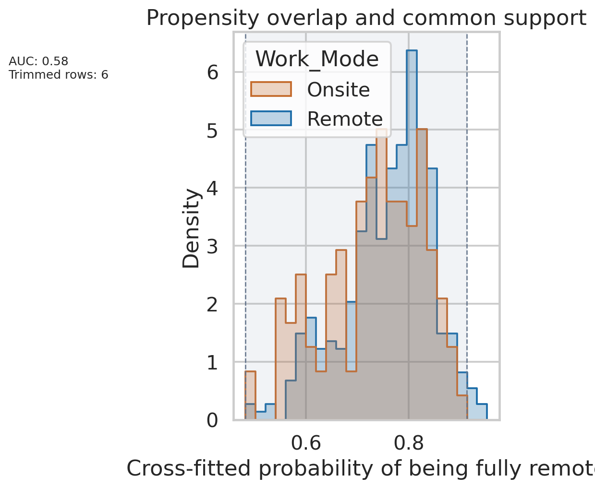
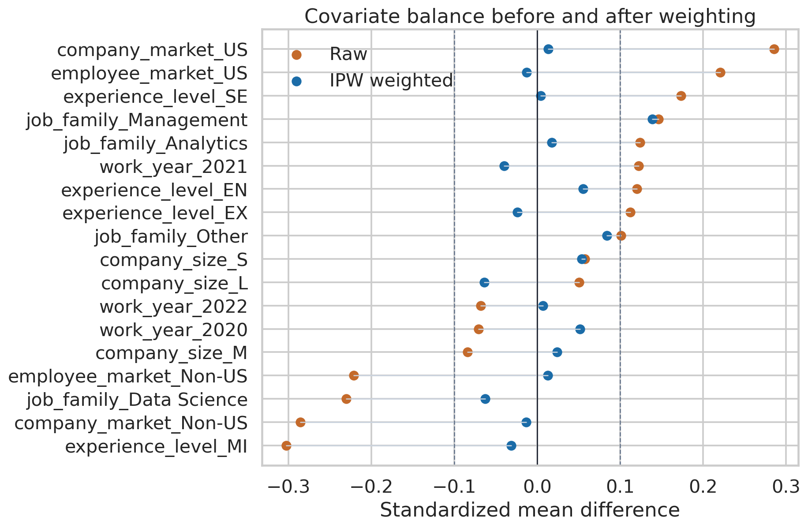
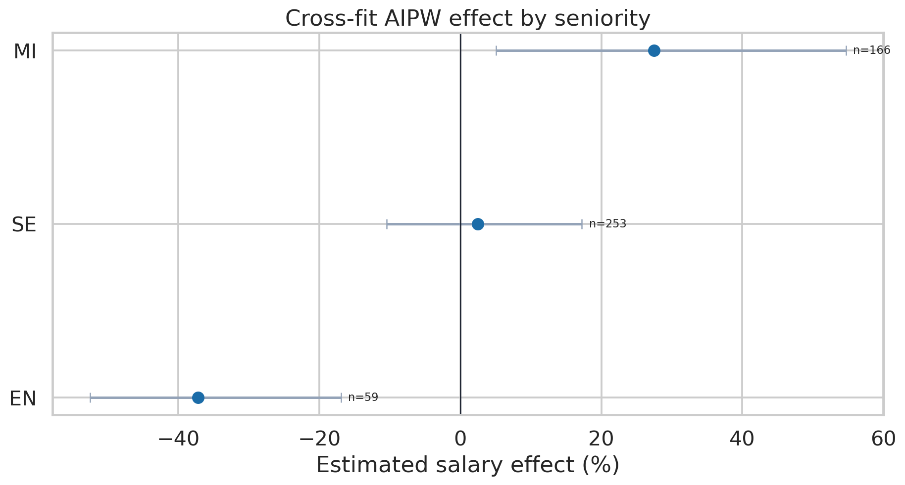
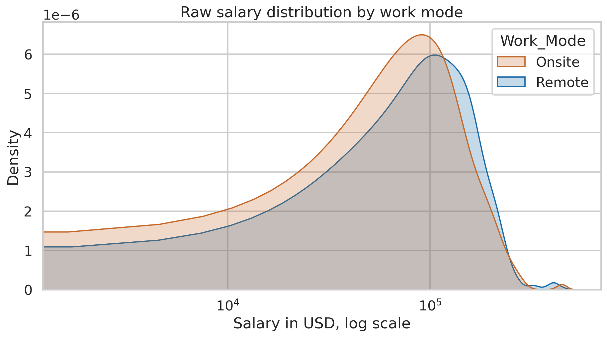
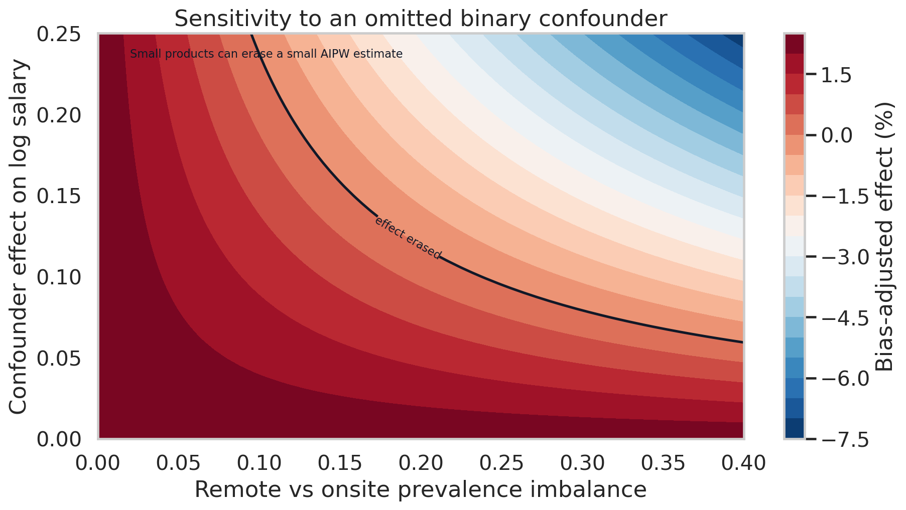

# Remote work salary premium: causal inference

Remote data-science jobs look better paid in the raw data. The causal question is whether that premium survives after comparing similar roles, seniority levels, company markets, employee markets, company sizes, and years.

This project treats fully remote work as the exposure and salary as the outcome. The notebook estimates the effect with cross-fitted nuisance models, inverse probability weighting, propensity-score matching, partial-linear DML, and a doubly robust AIPW estimator.

## Result

- Raw comparison: fully remote roles show a **+12.1%** salary difference.
- Cross-fit doubly robust estimate: the adjusted effect falls to **+2.4%**.
- 95% influence-function interval: **-8.2% to +14.2%**.
- Trimmed doubly robust estimate after overlap filtering: **+2.5%**.
- Only **6 rows** are removed by common-support and propensity trimming.

The read is simple, but important: the visible remote salary premium is mostly a composition story in this dataset. Once the model adjusts for observed differences, the estimated effect becomes small and statistically uncertain.

## Causal Setup

The estimand is the average treatment effect of fully remote work on log salary:

`E[Y(1) - Y(0)]`, where `Y(1)` is salary if the role is fully remote and `Y(0)` is salary if the role is onsite.

The identifying assumption is conditional exchangeability: after adjusting for the observed covariates, remote and onsite roles are comparable enough to estimate a treatment effect. That assumption is not directly testable, so the notebook reports overlap, balance, effective sample size, and omitted-confounder sensitivity.

## Data

- Source file: public `ds_salaries.csv` mirror on GitHub
- Raw rows: `607`
- Analysis rows: `498`
- Fully remote rows: `376`
- Onsite rows: `122`
- Treatment: `remote_ratio == 100`
- Control: `remote_ratio == 0`
- Excluded: hybrid roles and extreme salary records outside the project filter

The outcome is log salary in USD. The adjustment set uses only variables available before the salary outcome is observed:

- work year
- experience level
- job family
- employee market: US vs non-US
- company market: US vs non-US
- company size

## Method

The main estimate is cross-fitted AIPW. Each row receives out-of-sample predictions for:

- treatment probability, also called the propensity score
- expected salary if remote
- expected salary if onsite

Cross-fitting is useful here because it reduces overfitting in the nuisance models before the treatment effect is estimated.

The notebook also reports:

- naive difference in mean log salary
- regression adjustment
- Hajek inverse probability weighting
- nearest-neighbor matching on propensity score
- partial-linear double machine learning
- trimmed AIPW within common support

## Diagnostics

The overlap is usable. The model does not find a clean separation between remote and onsite roles, which is good for causal comparison. The cross-fitted propensity AUC is **0.58**, and the effective sample size is about **370 remote** and **106 onsite** rows after weighting.

Weighting reduces the largest observed imbalances, especially the market and seniority differences that make the raw salary comparison misleading. This does not fix unobserved confounding, but it makes the observed comparison more honest.

The effect is not stable across seniority levels. Some slices are small, so the subgroup results are best read as heterogeneity diagnostics rather than firm claims.

The raw distribution explains why the question is tempting: remote roles look shifted upward. The causal estimates show why that visual comparison is too quick.

The adjusted estimate is small enough that a modest omitted factor could erase it. A hidden variable with a combined log-salary effect times prevalence imbalance of about **0.024** would be enough to move the AIPW estimate to zero. That is the main limitation of the study.

## Interpretation

The result does not prove that remote work has no value. It says that, in this observational dataset, the salary premium visible in the raw data is not robust once role composition and market structure are adjusted.

The most defensible conclusion is:

> Fully remote data-science roles look better paid at first glance, but the adjusted evidence points to a small, uncertain premium rather than a large causal effect.

## Method Notes

This project follows a standard observational causal-inference workflow: define treatment and outcome, choose a pre-treatment adjustment set, estimate propensity and outcome models, check overlap and balance, then report a doubly robust effect with uncertainty.

The result is also consistent with recent research on work-from-home wage premiums: raw or lightly adjusted differences can shrink substantially once worker selection, role quality, and job composition are considered.

Useful references:

- Chernozhukov et al., double/debiased machine learning for treatment effects
- Robins, Rotnitzky, and Zhao, augmented inverse probability weighting
- Recent Federal Reserve research on work-from-home wage premiums

## Caveats

This is observational salary data, not an experiment. The estimate does not adjust for company brand, exact city, negotiation strength, equity, benefits, team scope, applicant quality, or whether remote work was chosen by the worker or required by the employer.

The project should be read as a causal-analysis portfolio report, not as a labor-market law.

## Files

- `remote_work_salary_causal_inference.ipynb`: clean notebook
- `test_data_source.py`: smoke test for the public CSV
- `assets/`: charts used in this report
- `results_summary.json`: machine-readable output from the latest notebook run
